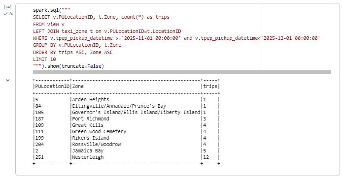

# Module 6 Homework: Batch Processing with Spark

The notebook used to solve this homework is in this folder.

## Question 1: Install Spark and PySpark

- Install Spark
- Run PySpark
- Create a local spark session
- Execute spark.version

What's the output?

- A: 4.0.2

```python
print(f"Spark version: {spark.version}")
```

## Question 2. Yellow November 2025

What is the average size of the Parquet (ending with .parquet extension) files that were created (in MB)? Select the answer which most closely matches.

- A: 25MB

```bash
!ls -lh {OUTPUT_PATH}
```

## Question 3. Count records

How many taxi trips were there on the 15th of November?
Consider only trips that started on the 15th of November.

- A: 162,604

```python 
spark.sql("""
SELECT COUNT(*)
FROM
    yellow_trips
WHERE DATE(tpep_pickup_datetime)='2025-11-15'
""").show()
```

## Question 4. Longest trip

What is the length of the longest trip in the dataset in hours?

- A: 90.6

```python
spark.sql("""
SELECT
    ROUND(MAX(
        (unix_timestamp(tpep_dropoff_datetime) - unix_timestamp(tpep_pickup_datetime)) / 3600
    ),1) AS longest_trip_hours
FROM yellow_trips
""").show()
```

## Question 5. User Interface

Spark's User Interface which shows the application's dashboard runs on which local port?

- A: 4040

```python 
spark.sparkContext.uiWebUrl
```

## Question 6. Least frequent pickup location zone

Using the zone lookup data and the Yellow November 2025 data, what is the name of the LEAST frequent pickup location Zone?

- Governor's Island/Ellis Island/Liberty Island
- Arden Heights
- Rikers Island
- Jamaica Bay

If multiple answers are correct, select any

A: Arden Heights, Eltingville/Annadale/Prince's Bay and Governor's Island/Ellis Island/Liberty Island

```python
spark.sql("""
SELECT y.PULocationID, t.Zone, count(*) as trips
FROM yellow_trips y
LEFT JOIN taxi_zone t on y.PULocationID=t.LocationID
WHERE y.tpep_pickup_datetime >='2025-11-01 00:00:00' 
    and y.tpep_pickup_datetime<'2025-12-01 00:00:00'
GROUP BY y.PULocationID, t.Zone
ORDER BY trips ASC, t.Zone ASC
LIMIT 10
""").show(truncate=False)
```

