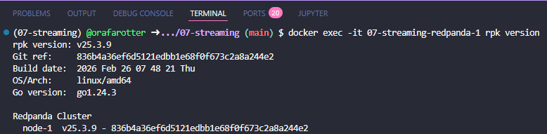
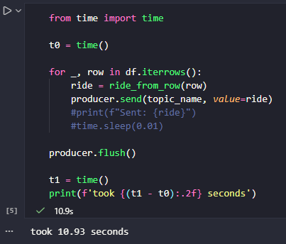

# Module 7 Homework: Streaming with PyFlink

The code used to solve this homework is in this folder.

## Question 1: Redpanda version

Run rpk version inside the Redpanda container:

```bash 
docker exec -it workshop-redpanda-1 rpk version
```

What version of Redpanda are you running?

- A: v25.3.9



## Question 2. Sending data to Redpanda

Create a topic called `green-trips`:

```bash
docker exec -it workshop-redpanda-1 rpk topic create green-trips
```

Now write a producer to send the green taxi data to this topic.

Read the parquet file and keep only these columns:

- `lpep_pickup_datetime`
- `lpep_dropoff_datetime`
- `PULocationID`
- `DOLocationID`
- `passenger_count`
- `trip_distance`
- `tip_amount`
- `total_amount`

Convert each row to a dictionary and send it to the `green-trips` topic.
You'll need to handle the datetime columns - convert them to strings
before serializing to JSON.

Measure the time it takes to send the entire dataset and flush.
How long did it take to send the data?

- A: 10 seconds



## Question 3. Consumer - trip distance

Write a Kafka consumer that reads all messages from the `green-trips` topic
(set `auto_offset_reset='earliest'`).

Count how many trips have a `trip_distance` greater than 5.0 kilometers.

How many trips have `trip_distance` > 5?

- A: 8506

```python 
from time import time

print(f"Listening to {topic_name}...")

count = 0
for message in consumer:
    ride = message.value
    if ride.trip_distance > 5.0:
        count += 1

print(f"Trips with trip_distance > 5.0: {count}")
```

## Question 4. Tumbling window - pickup location

Create a Flink job that reads from `green-trips` and uses a 5-minute
tumbling window to count trips per `PULocationID`.

Write the results to a PostgreSQL table with columns:
`window_start`, `PULocationID`, `num_trips`.

After the job processes all data, query the results.
Which `PULocationID` had the most trips in a single 5-minute window?

- A: 74

```SQL
SELECT PULocationID, num_trips
FROM pickup_location_counts
ORDER BY num_trips DESC
LIMIT 3;
```

## Question 5. Session window - longest streak

Create another Flink job that uses a session window with a 5-minute gap
on `PULocationID`, using `lpep_pickup_datetime` as the event time
with a 5-second watermark tolerance.

A session window groups events that arrive within 5 minutes of each other.
When there's a gap of more than 5 minutes, the window closes.

Write the results to a PostgreSQL table and find the `PULocationID`
with the longest session (most trips in a single session).

How many trips were in the longest session?

- A: 81

```SQL
SELECT PULocationID, num_trips
FROM session_counts
ORDER BY num_trips DESC
LIMIT 1;
```

## Question 6. Tumbling window - largest tip

Create a Flink job that uses a 1-hour tumbling window to compute the
total `tip_amount` per hour (across all locations).

Which hour had the highest total tip amount?

- A: 2025-10-16 18:00:00

```SQL
SELECT window_start, total_tip_amount
FROM tip_window
ORDER BY total_tip_amount DESC
LIMIT 1;
```